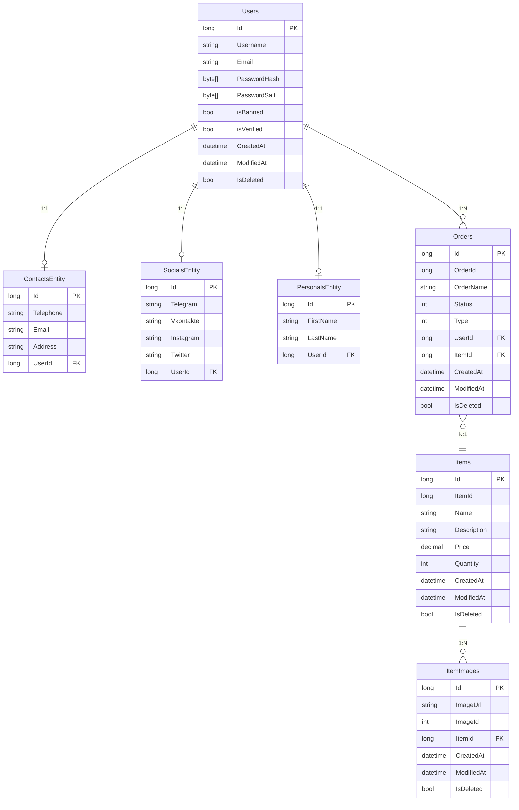

# MerchTrade

A classifieds board for buying, selling, and trading merch (games, anime, TV series, music acts). Currently at an early stage with a basic API and core features; plans include more functionality, stronger security, improved UI/UX, and mobile apps.

<p align="center">
  
</p>

---

## Architecture

The project follows **Clean Architecture** (layered architecture with dependency on the domain).

```
┌─────────────────────────────────────────────────────────────────┐
│                         MT.Api                                   │
│  (ASP.NET Core, controllers, JWT, CORS, Swagger, health, Serilog)│
└────────────────────────────┬────────────────────────────────────┘
                              │
┌────────────────────────────▼────────────────────────────────────┐
│                    MT.Application                                │
│  (Services: Auth, User, Item, Order; caching, business logic)    │
└────────────────────────────┬────────────────────────────────────┘
                              │
┌────────────────────────────▼────────────────────────────────────┐
│                    MT.Contracts                                  │
│  (DTOs, ApiResponse, PagedResult, request/response models)       │
└────────────────────────────┬────────────────────────────────────┘
                              │
┌────────────────────────────▼────────────────────────────────────┐
│                      MT.Domain                                   │
│  (Entities, repository interfaces, exceptions)                    │
└────────────────────────────▲────────────────────────────────────┘
                              │
┌────────────────────────────┴────────────────────────────────────┐
│                  MT.Infrastructure                               │
│  (EF Core, repositories, AutoMapper profiles, models, migrations) │
└─────────────────────────────────────────────────────────────────┘
```

| Layer | Purpose |
|-------|---------|
| **MT.Api** | Entry point: REST API, JWT, CORS, static files, Swagger (Development), **health checks** (`/health`), **Serilog** logging, **correlation ID** (`X-Correlation-Id`). |
| **MT.Application** | Services (Auth, User, Item, Order), **IMemoryCache** for items/orders lists, orchestration of repositories and mapping. |
| **MT.Contracts** | Shared DTOs, `ApiResponse`/`ApiErrorResponse`, `PagedResult<T>`, request/response types used by API and validation. |
| **MT.Domain** | Core: entities, repository interfaces, `NotFoundException` and other domain exceptions. No dependency on other layers. |
| **MT.Infrastructure** | Repository implementations, DbContext (SQL Server), AutoMapper profiles, models, migrations. |

Dependencies: **Api → Application, Contracts**; **Application → Domain, Infrastructure**; **Infrastructure → Domain**. The domain does not reference other projects.

---

## API

Base path: **`/api/v1/[controller]/[action]`** (API versioning).

**Response format:** Successful responses are wrapped as `{ "succeeded": true, "data": ... }`. Errors return `{ "succeeded": false, "errors": [ { "code": "...", "message": "..." } ] }` with the appropriate HTTP status (400, 401, 404, 500).

**Health:** `GET /health` returns JSON with overall status, individual checks (e.g. database), and duration. Useful for load balancers and monitoring.

**Pagination:** List endpoints (GetItems, GetUsers, GetOrders) support query parameters `page` and `pageSize` (default 1 and 20). Response is `PagedResult<T>`: `items`, `totalCount`, `page`, `pageSize`, `totalPages`. Responses are cached in memory (items/orders) with a short TTL; cache is invalidated on create/update.

### Auth (`/api/v1/Auth`)

| Method | Endpoint | Description | Auth |
|--------|----------|-------------|------|
| POST | `/api/v1/Auth/Register` | Register (body: `RegisterModel`). Validation: FluentValidation | — |
| POST | `/api/v1/Auth/Login` | Login (body: `LoginModel`). Sets `jwt` cookie and returns `token`, `username`, `userid` in body | — |
| POST | `/api/v1/Auth/GetUser` | Current user (Username, Email, Id from JWT) | JWT |

### User (`/api/v1/User`)

| Method | Endpoint | Description | Auth |
|--------|----------|-------------|------|
| GET | `/api/v1/User/GetUsers?page=1&pageSize=20` | List users with pagination | — |
| GET | `/api/v1/User/GetUser/{id}` | User by `id` (404 if not found) | — |
| POST | `/api/v1/User/CreateUser` | Create user (body: `UserModel`) | — |
| PUT | `/api/v1/User/UpdateUser/{id}` | Update user (body: `UserUpdateModel`). Only own `userId` per token | JWT |

### Item (`/api/v1/Item`)

| Method | Endpoint | Description | Auth |
|--------|----------|-------------|------|
| GET | `/api/v1/Item/GetItems?page=1&pageSize=20` | List items with pagination | — |
| GET | `/api/v1/Item/GetItem/{id}` | Item by `id` (404 if not found) | — |
| POST | `/api/v1/Item/CreateItem` | Create item (body: `ItemModel`) | — |

### Order (`/api/v1/Order`)

| Method | Endpoint | Description | Auth |
|--------|----------|-------------|------|
| GET | `/api/v1/Order/GetOrders?page=1&pageSize=20` | List orders with pagination | — |
| GET | `/api/v1/Order/GetOrder/{orderId}` | Order by `orderId` (404 if not found) | — |
| GET | `/api/v1/Order/GetOrdersByUserId/by-user/{id}` | Orders by user `userId` | — |
| POST | `/api/v1/Order/CreateOrder` | Create order (`multipart/form-data`, `OrderCreateFormModel`) | — |
| PUT | `/api/v1/Order/UpdateOrder/{orderId}` | Update order (`multipart/form-data`, `OrderUpdateModel`) | — |

In **Development**, Swagger UI is available (see the Swagger URL in your launch settings). Logging uses **Serilog** (console; configurable in `appsettings.json`). Each request gets a **correlation ID** in the `X-Correlation-Id` response header for tracing.

---

## ER Diagram

Simplified data model: users with contacts, socials, and personal data; orders linked to user and item; items have a collection of images.



- **OrderStatus**: Active, Booked  
- **OrderType**: Sell, Buy, Trade  
- Common fields (CreatedAt, ModifiedAt, IsDeleted) are inherited from the base entity.

---

## Getting Started

### Requirements

- **.NET 8 SDK**
- **SQL Server** (e.g. LocalDB, Express, or full instance)
- Optional: **Rider** / **Visual Studio** / **VS Code** with C# extensions

### 1. Clone and restore

```bash
git clone https://github.com/starcrusher777/mt-website.git
cd mt-website
dotnet restore
```

### 2. Connection string

In **MT.Api**, edit `appsettings.json` (or `appsettings.Development.json`):

```json
{
  "ConnectionStrings": {
    "DefaultConnection": "Server=(localdb)\\MSSQLLocalDB;Database=merchTradeDb;Trusted_Connection=True;TrustServerCertificate=True;"
  }
}
```

Replace with your server, database, and credentials if needed. For LocalDB you can leave as is.

### 3. Apply migrations

Migrations live in **MT.Infrastructure**. From the solution root:

```bash
dotnet ef database update --project MT.Infrastructure --startup-project MT.Api
```

If `dotnet ef` is not installed:

```bash
dotnet tool install --global dotnet-ef
```

This creates or updates the `merchTradeDb` database (or the one in your connection string).

### 4. Run the API

From the solution root:

```bash
dotnet run --project MT.Api
```

Or open `MerchTrade.sln` in your IDE and run **MT.Api** (F5 / Run).

The app listens on the port from `launchSettings.json` (often `http://localhost:5xxx`). Swagger is available in Development at the configured URL (e.g. `/swagger`).

### 5. JWT (optional)

The `Jwt` section (Key, Issuer, Audience) is already in `appsettings.json`. For production, change **Jwt:Key** to a strong secret and store it in User Secrets or environment variables.

### 6. Run tests

From the solution root:

```bash
dotnet test MerchTrade.sln
```

- **MT.Application.UnitTests**: xUnit + NSubstitute; tests for AuthService (login invalid/valid) and ItemService (get item not found / found).
- **MT.Api.IntegrationTests**: WebApplicationFactory + in-memory DB; tests for GetOrders (200), Login (401 for invalid credentials), Register (200/409).

### 7. Frontend

CORS in `Program.cs` allows `http://localhost:3000` and `http://localhost:3001`. Run the frontend on one of these ports or add your origin to the `AllowFrontend` policy.

### 8. Database backup and migrations

See **[docs/DATABASE.md](docs/DATABASE.md)** for SQL Server backup/restore commands and EF Core migration rollback steps.

---

## Solution structure

```
MerchTrade.sln
├── MT.Api/                     # Web API, controllers, health, Serilog
├── MT.Application/             # Application services, caching
├── MT.Application.UnitTests/   # Unit tests (xUnit, NSubstitute)
├── MT.Api.IntegrationTests/    # API integration tests (WebApplicationFactory)
├── MT.Contracts/               # DTOs, ApiResponse, PagedResult
├── MT.Domain/                  # Entities, interfaces, exceptions
├── MT.Infrastructure/          # EF Core, repositories, migrations
└── docs/                       # DATABASE.md (backup, restore, migrations)
```

---

## CI

**GitHub Actions** (`.github/workflows/build-and-test.yml`): on push/PR to `main` or `master`, runs `dotnet restore`, `dotnet build` (Release), and `dotnet test`.

---

## License and contribution

The project is developed in spare time. Plans: more features, security, UI/UX improvements, mobile apps (iOS/Android).

Suggestions for improving architecture, tech stack, and processes are in [IMPROVEMENTS.md](IMPROVEMENTS.md) (if present locally).
